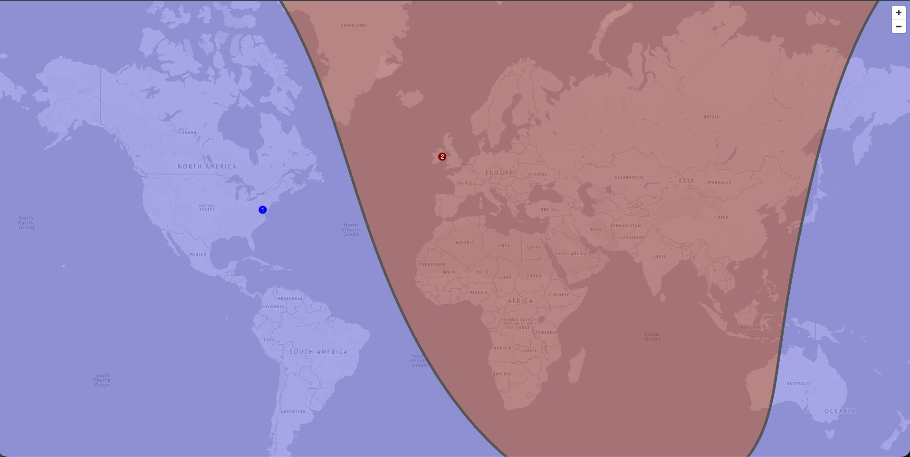
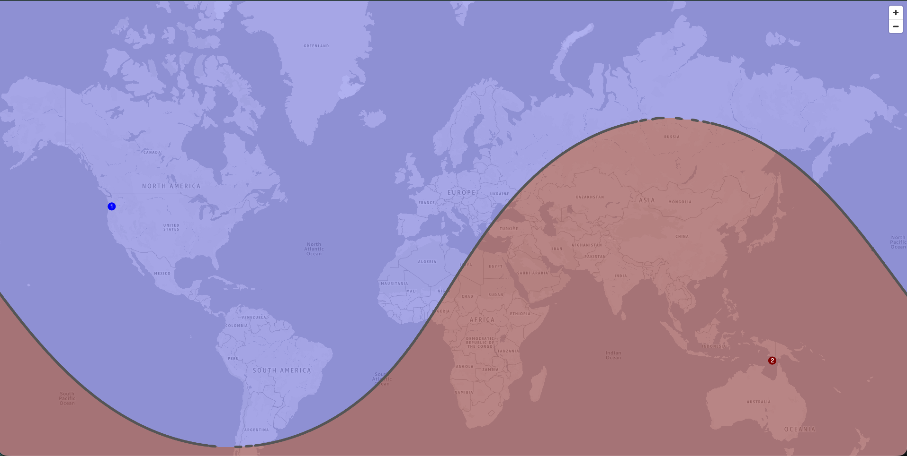
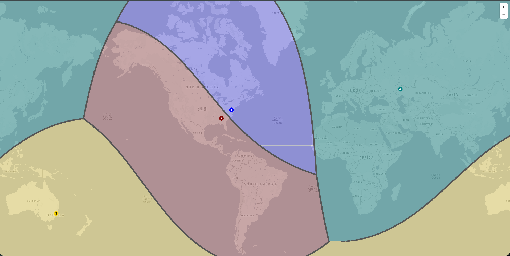

# geoproximity-map

A React component that visualizes geoproximity routing regions on an interactive world map.

## Introduction

This component takes a list of endpoint locations (AWS regions, local zones, or custom coordinates) with bias values and renders weighted geoproximity regions on a [MapLibre GL](https://maplibre.org/maplibre-gl-js/docs/) map. Each region is color-coded and sized based on the endpoint's bias.

## Installation

Install the package from npm:

```bash
npm install geoproximity-map
```

This package declares `react` as a peer dependency. If your package does not already include it, add it to your `package.json`:

```json
{
  "dependencies": {
    "react": "^18.2.0"
  }
}
```

## Prerequisite - Amazon Location Service API Key

1. Go to the [Amazon Location Service console](https://console.aws.amazon.com/location/home) and select **API keys** in the left navigation.

2. Click **Create API key**. Give it a name (e.g. `geoproximity-map-key`) and attach the `GetTile` actions.

3. Copy the generated key value.

4. Store the key securely — never commit it to source control. Use an environment variable:

   ```bash
   # .env (add to .gitignore)
   LOCATION_API_KEY=v1.public.xxx
   ```

## API Reference

### `<GeoproximityMap>`

| Prop         | Type                            | Description                                                                                                                                                                                                                                                                                                                |
| ------------ | ------------------------------- | -------------------------------------------------------------------------------------------------------------------------------------------------------------------------------------------------------------------------------------------------------------------------------------------------------------------------- |
| `endpoints`  | `EndpointInput[]`               | List of geoproximity endpoints to render on the map. Invalid entries are dropped with a console warning. Duplicate entries (same coordinates) are also dropped.                                                                                                                                                            |
| `styleUrl`   | `string`                        | Amazon Location Service style descriptor URL. Throws `TypeError` if malformed. See [Style URL Reference](#style-url-reference) below.                                                                                                                                                                                      |
| `onMapReady` | `(map: maplibregl.Map) => void` | Optional. Called once with the underlying MapLibre map after it loads. A read-only escape hatch for callers that need the map instance (e.g. to translate clicks to coordinates); the component still renders only `endpoints`. The callback may be an inline function — the map is not rebuilt when its identity changes. |

### `EndpointInput`

Four types of inputs are accepted:

| Type             | Fields                                                            | Description                                                                           |
| ---------------- | ----------------------------------------------------------------- | ------------------------------------------------------------------------------------- |
| `Region`         | `{ type: 'Region', name: string, bias?: number }`                 | An AWS region. Coordinates are resolved from the built-in region table.               |
| `LocalZoneGroup` | `{ type: 'LocalZoneGroup', name: string, bias?: number }`         | An AWS local zone group. Coordinates are resolved from the built-in local zone table. |
| `Coordinate`     | `{ type: 'Coordinate', lat: number, lon: number, bias?: number }` | A custom lat/lon coordinate. Latitude must be in [-90, 90], longitude in [-180, 180]. |
| `Custom`         | `{ type: 'Custom', name: string, bias?: number }`                 | A named custom location. Coordinates are resolved from the custom data table.         |

**Bias** (optional): An integer in the range [-99, 99], defaults to 0. Positive bias enlarges the endpoint's routing region; negative bias shrinks it.

### Style URL Reference

The `styleUrl` prop tells MapLibre GL where to fetch map data and how the base map should be styled (colors, fonts, labels, and what's visible at each zoom level).

**URL anatomy:**

```
https://maps.geo.{Region}.amazonaws.com/v2/styles/{Style}/descriptor?key={ApiKey}&color-scheme={ColorScheme}&political-view={CountryCode}
```

**Fields:**

| Field         | Required | Allowed Values                                  | Default | Description                                                                      |
| ------------- | -------- | ----------------------------------------------- | ------- | -------------------------------------------------------------------------------- |
| Region        | Yes      | Any AWS region (e.g. `us-east-1`)               | —       | Determines which AWS region's geo-maps endpoint serves the tiles                 |
| Style         | Yes      | `Standard`, `Monochrome`, `Hybrid`, `Satellite` | —       | Base map style. `Monochrome` is the current default for the Traffic Flow Console |
| ApiKey        | Yes      | API key string                                  | —       | Authentication for client-side MapLibre requests                                 |
| ColorScheme   | No       | `Light`, `Dark`                                 | `Light` | Should follow host UI theme                                                      |
| PoliticalView | No       | ISO 3166 country code (e.g. `IND`, `ARG`)       | Neutral | Localized border rendering                                                       |

Full API reference: [GetStyleDescriptor](https://docs.aws.amazon.com/location/latest/APIReference/API_geomaps_GetStyleDescriptor.html)

## Usage Examples

### Basic: Two regions

```tsx
import { GeoproximityMap } from "geoproximity-map";

const styleUrl = `https://maps.geo.us-east-1.amazonaws.com/v2/styles/Monochrome/descriptor?key=${process.env.LOCATION_API_KEY}`;

<GeoproximityMap
  styleUrl={styleUrl}
  endpoints={[
    { type: "Region", name: "us-east-1", bias: 10 },
    { type: "Region", name: "eu-west-1", bias: -5 },
  ]}
/>;
```



### Mixed: Region + Coordinate

```tsx
import { GeoproximityMap } from "geoproximity-map";

const styleUrl = `https://maps.geo.us-east-1.amazonaws.com/v2/styles/Monochrome/descriptor?key=${process.env.LOCATION_API_KEY}`;

<GeoproximityMap
  styleUrl={styleUrl}
  endpoints={[
    { type: "Region", name: "us-west-2", bias: 0 },
    { type: "Coordinate", lat: -10, lon: 139.75, bias: 20 },
  ]}
/>;
```



### Multiple endpoint types

```tsx
import { GeoproximityMap } from "geoproximity-map";

const styleUrl = `https://maps.geo.us-east-1.amazonaws.com/v2/styles/Monochrome/descriptor?key=${process.env.LOCATION_API_KEY}&color-scheme=Light`;

<GeoproximityMap
  styleUrl={styleUrl}
  endpoints={[
    { type: "Region", name: "us-east-1", bias: 0 },
    { type: "LocalZoneGroup", name: "us-east-1-atl-1", bias: 5 },
    { type: "Coordinate", lat: -33.85, lon: 151.21, bias: -10 },
    { type: "Custom", name: "custom-endpoint", bias: 5 },
  ]}
/>;
```



## Demo

The `demo/` directory contains a runnable [Vite](https://vite.dev/) application that
showcases the component with interactive editing built on top of it: adding
endpoints via a modal or by clicking the map, dragging endpoints to reposition
them, and a hover popup with a bias slider. The interactive pieces live in the
demo (not the component) — the component itself stays a pure visualization tool.

### Running the demo

1. Create an Amazon Location Service API key (see
   [Prerequisite - Amazon Location Service API Key](#prerequisite---amazon-location-service-api-key)).

2. From the `demo/` directory, install dependencies:

   ```bash
   cd demo
   npm install
   ```

3. Copy the example env file and add your key:

   ```bash
   cp .env.example .env
   # then edit .env and set VITE_AMAZON_LOCATION_KEY=<your-key>
   ```

   | Variable                   | Required | Default      | Description                       |
   | -------------------------- | -------- | ------------ | --------------------------------- |
   | `VITE_AMAZON_LOCATION_KEY` | Yes      | —            | Amazon Location Service API key   |
   | `VITE_AWS_REGION`          | No       | `us-east-1`  | Region for the map style endpoint |
   | `VITE_MAP_STYLE`           | No       | `Monochrome` | Base map style                    |

4. Start the dev server:

   ```bash
   npm run dev
   ```

> The demo reads its key from `demo/.env`, which is git-ignored. Never commit a
> real API key.

## Supported Regions

| Region         | Region         | Region         |
| -------------- | -------------- | -------------- |
| us-east-1      | us-east-2      | us-west-1      |
| us-west-2      | ca-central-1   | ca-west-1      |
| eu-west-1      | eu-west-2      | eu-west-3      |
| eu-central-1   | eu-central-2   | eu-north-1     |
| eu-south-1     | eu-south-2     | af-south-1     |
| ap-east-1      | ap-east-2      | ap-south-1     |
| ap-south-2     | ap-southeast-1 | ap-southeast-2 |
| ap-southeast-3 | ap-southeast-4 | ap-southeast-5 |
| ap-southeast-7 | ap-northeast-1 | ap-northeast-2 |
| ap-northeast-3 | me-south-1     | me-central-1   |
| sa-east-1      | il-central-1   | mx-central-1   |
| cn-north-1     | cn-northwest-1 |                |

## Supported Local Zones

| Local Zone           | Local Zone           | Local Zone           |
| -------------------- | -------------------- | -------------------- |
| us-east-1-atl-1      | us-east-1-atl-2      | us-east-1-abe-1      |
| us-east-1-bos-1      | us-east-1-bue-1      | us-east-1-chi-1      |
| us-east-1-chi-2      | us-east-1-dfw-1      | us-east-1-dfw-2      |
| us-east-1-iah-1      | us-east-1-iah-2      | us-east-1-lim-1      |
| us-east-1-mci-1      | us-east-1-mia-1      | us-east-1-mia-2      |
| us-east-1-msp-1      | us-east-1-nyc-1      | us-east-1-nyc-2      |
| us-east-1-phl-1      | us-east-1-qro-1      | us-east-1-scl-1      |
| us-east-2-jan-1      | us-east-2-sbn-1      | us-west-2-den-1      |
| us-west-2-las-1      | us-west-2-lax-1      | us-west-2-pdx-1      |
| us-west-2-phx-1      | us-west-2-sea-1      | eu-central-1-ham-1   |
| eu-central-1-waw-1   | eu-north-1-cph-1     | eu-north-1-hel-1     |
| ap-south-1-ccu-1     | ap-south-1-del-1     | ap-southeast-1-bkk-1 |
| ap-southeast-1-mnl-1 | ap-southeast-2-akl-1 | ap-southeast-2-per-1 |
| ap-northeast-1-tpe-1 | af-south-1-los-1     | me-south-1-mct-1     |

## Custom Locations

The `Custom` endpoint type is for package maintainers to add named locations that are neither AWS regions nor local zones (e.g., edge locations, special endpoints). These are defined in `src/data/custom.json`:

```json
{
  "custom-endpoint": { "lat": 50, "lon": 50 }
}
```

Consumers who need a custom location should use the `Coordinate` type directly — no package modification required.

> **Note:** Custom entries take priority over regions and local zones if names overlap.

## Security

See [CONTRIBUTING](CONTRIBUTING.md#security-issue-notifications) for more information.

## License

This project is licensed under the Apache-2.0 License.
